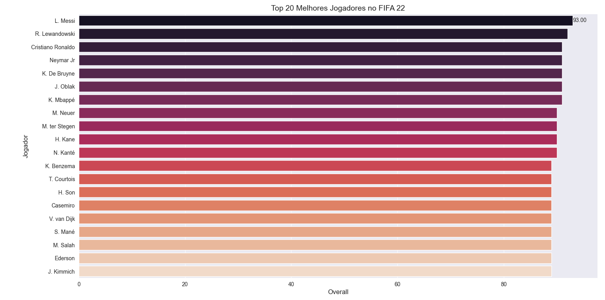
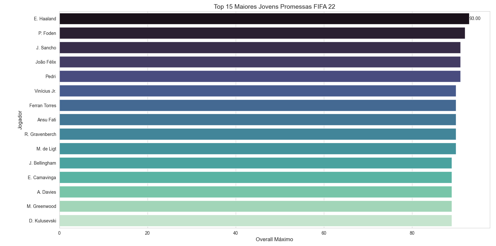
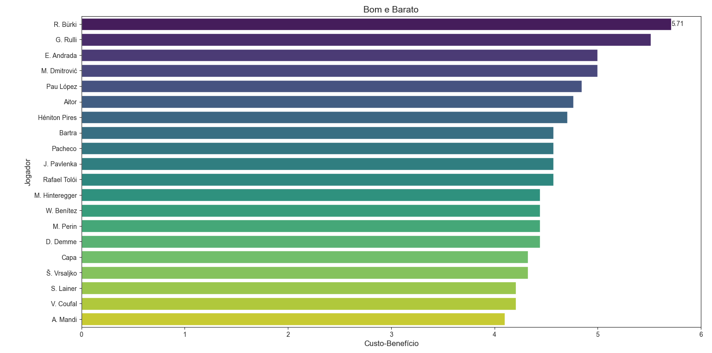

# Análise de Dados de Jogadores do FIFA 22 ⚽

## 📖 Visão Geral do Projeto

Este projeto realiza uma **Análise Exploratória de Dados (EDA)** sobre o dataset "FIFA 22 complete player dataset", uma compilação massiva de dados de jogadores disponível no Kaggle.

O objetivo é atuar como um "olheiro" digital (scout), utilizando Python e suas poderosas bibliotecas de análise de dados (**Pandas**, **Matplotlib** e **Seaborn**) para identificar os jogadores de elite, as jovens promessas e os atletas com o melhor custo-benefício presentes no jogo.

---

## 📊 Análises Realizadas e Insights

Foram realizadas três análises principais para responder a diferentes perguntas de negócio e curiosidades de fãs do esporte e do game.

### 1. Quem são os Melhores do Mundo?
A primeira análise buscou identificar, de forma direta, os jogadores com a maior pontuação geral (`overall`) no jogo. O resultado mostra a elite do futebol mundial, com nomes consagrados no topo da lista.

### 2. Quem são as Futuras Estrelas? (Wonderkids)
Esta análise foca em "caçar talentos". Foram filtrados jogadores com 21 anos ou menos e, em seguida, ordenados pelo seu potencial de crescimento (`potential`). O resultado é uma lista valiosa para os jogadores do "Modo Carreira" que buscam contratar as futuras estrelas do futebol.

### 3. Análise 'Moneyball': Quem são os Jogadores "Bons e Baratos"?
A análise mais complexa do projeto, que busca encontrar jogadores subvalorizados. Para isso, foi criada uma métrica customizada de **Custo-Benefício** (`overall` / `valor em milhões de euros`). A busca foi refinada para atletas de alta qualidade (`overall >= 80`) e que ainda não estão no fim da carreira (`idade <= 30`), revelando os melhores negócios do jogo.

---

## 📈 Visualizações Geradas

| Top 20 Melhores do Mundo | Top 15 Jovens Promessas | Top 20 Custo-Benefício |
| :---: | :---: | :---: |
|  |  |  |

---

## 🛠️ Tecnologias Utilizadas

* **Linguagem:** Python
* **Bibliotecas:** Pandas, Matplotlib, Seaborn
* **Dataset:** [FIFA 22 complete player dataset (Kaggle)](https://www.kaggle.com/datasets/stefanoleone992/fifa-22-complete-player-dataset)

---

## 👨‍💻 Autor

**Juan Moreno**

* **LinkedIn:** [https://www.linkedin.com/in/juan-da-cunha-moreno-29752a222](https://www.linkedin.com/in/juan-da-cunha-moreno-29752a222)
* **GitHub:** [https://github.com/Juan-Moreno-22](https://github.com/Juan-Moreno-22)